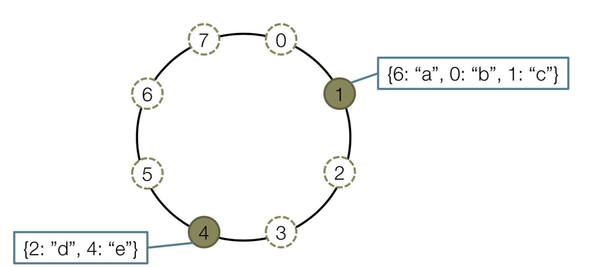
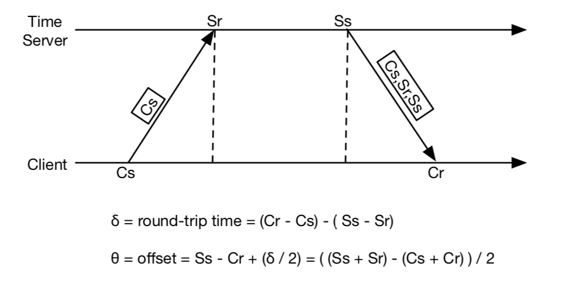
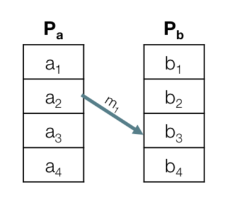
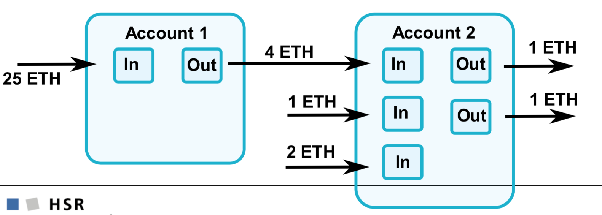
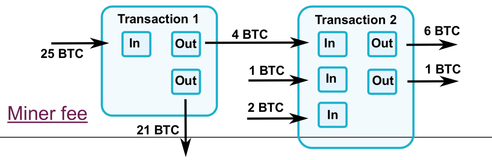
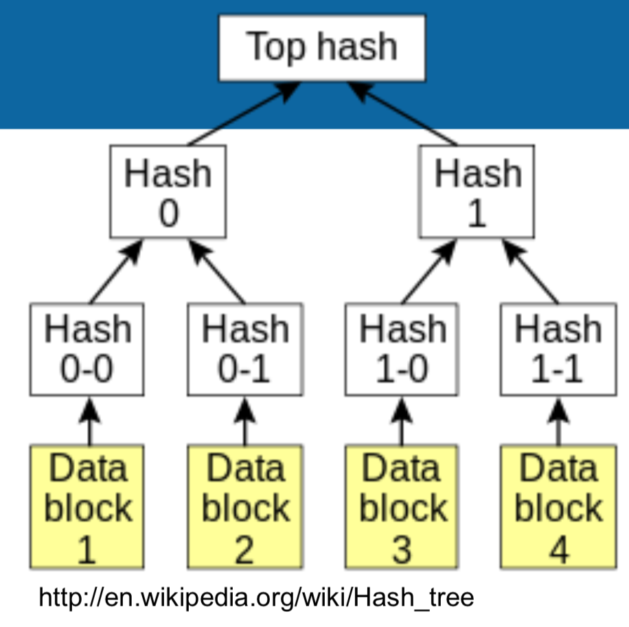
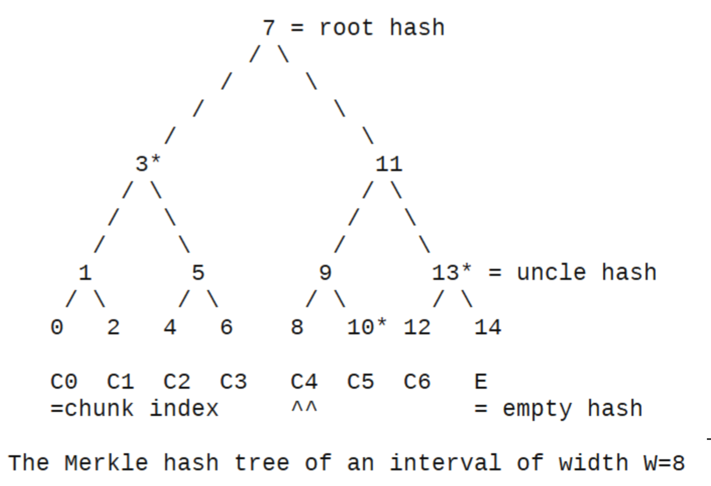

# Naming Systems

## Begriffe

| Begriff                   | Beschreibung                             |
| ------------------------- | ---------------------------------------- |
| Naming                    | Namen entities zuweisen                  |
| Name Resolution           | Name auflösen, Entity aufgrund von Name ermitteln |
| Name                      | Bytestring um Entität zu Identifizieren<br />*Beispiel DNS: Fully Qualified Domain Name* |
| Entity                    | *Beispiel DNS: Host*                     |
| Access Point              | Entität, welche verwendet wird um auf andere Entitäten zuzugreifen<br />*Beispiel DNS: Network Interface* |
| Address                   | Name von access point<br />*Beispiel DNS: IP* |
| Identifier                | Name mit folgenden Kriterien (wie Primary Key in DB):<br />- Referenziert höchstens eine Entität<br />- Jede Entität wird höchstens von einem Identifier referenziert<br />- Referenziert immer die Gleiche Entität (nicht wiederverwendet) |
| Human Friendly Name       | Für menschliche Nutzung angepasster Name, z.B. Domain Name |
| Location Independent Name | Standort von Entität kann ändern und trotzdem noch mit ihrem Namen gefunden werden. |

## Flat Naming

- Namen sind unstrukturiert (interne Struktur erlaubt z.B. IP Adresse, aber nicht für Auflösung verwendet)
- Broadcasting wird zur Auflösung verwendet, z.B. in ARP: "Wer ist 10.1.2.4 ?"

### Vorteile:

- kein Masterknoten benötigt
- einfach zu implementieren

### Nachteile:

- Skalliert nicht
- Einfach sich als andere Entity auszugeben

## Structured Naming

- Hierarchisch strukturiert, z.B. DNS
- Unterschiedliche Ebenen mit unterschiedlichen Verantwortungen, z.B. DNS: Global Layer, Administrational Layer, Managerial Layer
- **Iterative Auflösung**: tiefere Belastung der Server
- **Rekursive Auflösung**: Bessere Caching Möglichkeiten, macht Sinn wenn gleicher Request oft ausgeführt wird, z.B. www.google.com

## Attribute Based Naming

* Benutzer sucht mit Beschreibung in form von Attribute-Value Paar
* z.B. LDAP (Lightweight Directory Access Protocol): Mix aus Structured und Attribute Based Naming

# Distributed Hash Tables

- Ähnliches Prinzip, wie Java HashTable
- Key = hashCode(fileURL), Value = Id von verantwortlichem Node
- location(fileURL) = hashCode(fileURL) % nrOfNodes
- Verwendet speziellen Hash Algorithmus, so dass beim Hinzufügen und Entfernen von Nodes im Schnitt nur numberOfKeys / numberOfNodes Entries verschoben werden müssen.

## Chord

- Implementation von P2P DHT

- Benutzt m-Bit Identifiers für Nodes und Keys

- Namespace-Grösse: 2^m

- m ist fix und gross (128, 160)

- Benutzt Hash Funktion mit Range 0 - 2^m - 1

- Nodes kann man sich als logischen Ring vorstellen, Beispiel mit m = 3 und zwei Nodes:

  

- Nodes werden mit id (p) identifiziert, p = hash(IPAdressOfNode)

- Jeder Node kennt seinen successor, 1.successor = 4, 4.successor = 1

- Entität mit Key k gehört zu Node mit kleinstem Identifier p, so dass p >= k

- succ(k) Funktion (distributed function) gibt zurück auf welchem Node k gespeichert ist, z.B. succ(2) = 4

### Join

Um Joins effizienter zu machen, merkt sich jeder Node seinen Predecessor, z.B. 4.predecessor = 1.

1. Neuer Node n sucht seinen successor n.successor = succ(n  + 1)
2. Predecessor muss seinen successor updaten, wird aber nicht sofort gemacht sondern ersten im Stabilization Prozess
3. Alle resourcen von succ(n+1) mit Keys k so dass succ(k) = n müssen nach n verschoben werden

### Leaving (planned)

1. Node n will Ring verlassen
2. Alle resourcen von n werden an n.successor übergeben
3. n.predecessor wird informiert seinen successor auf n.successor zu ändern

### Lookup

- Naiver ansatz wäre Linearer Search => O(numberOfNodes) (jeder Node kennt seinen Successor, weiter bis Node verantwortlicher Node erreicht ist)
- Finger Table für schnelleren Lookup O(log N)
- Finger Table hat index i in Range 1 - m
- p.finger[i] zeigt auf succ(p + 2^(i - 1)) => p.figner[1] = succ(p + 1) = p.successor

**Beispiel p.lookup(k, a)**: Suche value für Key k und schicke Resultat an Adresse a:

1. Wenn p verantwortlich ist (p.predecessor < k <= p) sende id und Resource an a
2. Wenn Successor verantwortlich ist ( p < k <= p.successor), leite request an p.successor weiter
3. Sonst nächster Predecessor in Finger Table suchen und an diesen weiterleiten

### Stabilization

* Jeder Node führt regelmässig eine Stabilization durch. Dabei wird überprüft ob successor, predecessor und fingertable noch stimmen und falls nötig korrigiert.
* Successor wird überprüft indem p prüft ob p.successor.predecessor = p
* Predecessor wird korrigiert indem jeder Node, seinen Successor periodisch informiert, dass er der Predecessor ist.
* Jeder Node korrigiert regelmässig zufällige finger table entries: finger[i] = p.successor.lookup(n + 2^(i - 1), p)

### Leaving (unplanned)

- n verlässt Ring unerwartet 
- Alle Ressourcen von n gehen verloren 
- Ring ist unterbrochen bis nächste Stabilization

### Replication

- Replication ist Lösung damit Resourcen bei unplanned Leaves nicht verloren gehen.

- Jeder Entry wird r mal repliziert an folgenden Positionen:

  ```java
  for (int i = 0; i < r - 1; i++) {
    int replIdx = (hash(FileUrl) + i * Math.pow(2, m) / r) % Math.pow(2, m);
      storeReplicaAtPosition(replicaIndex);
  }
  ```

- Periodisch wird geprüft, ob alle Replikas noch verfügbar sind

# Synchronization

Synchronisierung von Zeit in einem verteilten System

## Physical Clocks

- Verschiedene Zeitzonen / Kalenderformate
- Basierend auf Quartzkristallen

### NTP



Offset wird korrigiert indem die Uhr schneller oder langsamer laufen gelassen wird. Ansonsten läuft man in die Gefahr, dass in Programmen, welche annehmen, dass die Zeit nur in eine Richtung läuft, Bugs auftreten.

## Logical Clocks

- Wird z.B. verwendet um zu Garantieren, dass Updatereihenfolge in einem verteilten DB-System, auf allen Nodes gleich ist.
- Die genaue Zeit von Ereignissen ist oft nicht wichtig, solange die Reihenfolge klar ist.

### Causality

* Causality ist als *happens before* relation bekannt, e.g. a &rarr; b (event a passiert vor event b)
* a &rarr; b ist wahr wenn mindestens eine der folgenden Bedingungen wahr ist:
  * a und b laufen im gleichen Prozess und a passiert vor b
  * a ist der Event des Sendens einer Nachricht und b ist der Event des Empfangens der gleichen Nachricht
  *  a&rarr; x && x &rarr; b (transitivität)

### Concurrency

* a || c heisst einfach, dass es keine &rarr; Relationen zwischen a und c gibt. 

### Übung Causality / Concurrency 



a1 &rarr; a3 wahr

a1 &rarr; b1 falsch

a1 || b1 wahr

a1 || a2 falsch

### Lambert's Logical Clock

TODO

# Bitcoin

Alle 10 Minuten neuer Block (Netzwerk ändert die Schwierigkeit, dass dies meistens der Fall ist). Die Schwierigkeit definiert, wieviel des Hashes übereinstimmen muss.

Wenn ein neuer Block geminet wird, erhält man momentan 12.5 BTC, was auch vom Netzwerk festgelegt wird.

Zusätzlich erhält man die Fees, der Transaktionen welche man in seinen Block aufgenommen hat.

Maximal 21 Mio BTC

Ab 6 nachfolgenden Blöcken wird dieser Block als bestätigt angesehen. Damit verhindert man, dass sich (längere) Trees bilden.

## Nachteile

* Power Consumption: 6 AKW Leibstadt
* Skalierbarkeit: Bitcoin 7 Transactions per Second, Visa 57'000
* Volatile Exchange Rate

# Etherum/Smart Contracts

Neuer Block alle 14s, ergibt 3 ETH (fix)

Nicht als Crypto-Währung gedacht!

Idee:

* Smart Contracts schreiben (Programm)
* Anweisungen haben einen Gas Price (in Gwei, 1 Milliarde Gwei= 1 ETH)
* Man sendet den Smart Contract und die Funds ins Netzwerk
* Falls die Funds nicht ausreichen (vom Miner validiert), wird der Zustand zurückgesetzt und die ETH/Gwei sind weg

Man kann das Ethereum-Netzwerk als globalen Computer ansehen. Jede Node rechnet den Smart Contract durch und erhält das gleiche Ergebnis. Kann man als "Etherum VM" (EVM) ansehen.

Basiert momentan noch auf Proof of Work, aber nicht ASIC-tauglich

Zwei Account-Arten:

* *externally controlled* (kontrolliert von einem Private Key)
* *contract*. Laufen nie von alleine, von Code kontrolliert, Aktionen werden von externally controlled-Accounts ausgelöst

Beide können ETH senden/empfangen

Bitcoin ist, im Gegensatz, UTXO-based.

## Account-based vs UTXO-based

Account-basiert

* Globaler State mit Accounts, die Balance und Code beinhalten
* Transaktion ist valid, wenn der Account genügend Balance hat
* Wenn der Receiver Code hat, läuft dieser
* Weniger Speicherplatz
* Einfacher ("Easier for smart contracts, stateful scripting")



UTXO-basiert

* Jeder Input muss valid sein und noch nicht verbraucht sein
* Der totale Input muss dem totalen Output entsprechen* (* oder darunter sein, aber das macht man nicht...)
* Höhere Privacy (neue Adresse für jede Transaktion)
* Keine Replay-Attacks (jedes Mal eine neue Nonce) **versteh ich noch nicht ganz**
* Transaktionen können parallel laufen, wenn Output/Input separat




## Merkle Tree

Hash-Tree. Hash 0 = Hash 0-0 || Hash 0-1 (|| = Concatenation)



### Beispiel eines Merkle Trees

Verification (BitTorrent)

* Peer A has top hash (root hash) 
* Peer downloads C4 from peer B
* create hash 8
* Need hash 10, 13, 3 (uncle hash)
* Can be from peer B 
* With 8,10,13,3 can create root hash → verify this root hash 



## Solidity

Sprache für Smart Contracts für Ethereum **nur für Ethereum?**

Um den Preis zu begründen, kann man sich immer überlegen, dass alle Nodes diese Berechnung durchführen müssen.

State-Variablen sind teuer!

Kennt primitive Typen, Structs, Maps und Arrays

`constant` Funktionen modifizieren den State nicht (siehe Getter-Code:)

```
function get(uint nr) public constant returns (string) { 
	return accounts[nr].addr;
}
function set(uint nr, string addr) public {
	require(owner == msg.sender);
	accounts[counter++] = Account(addr, nr); 
}
```

Reads sind gratis!

Preconditions mit require (z.B. Owner dieses Contracts = Absender `require(owner == msg.sender)`)

Gibt auch Events/Notifications (geht er aber nicht weiter drauf ein)