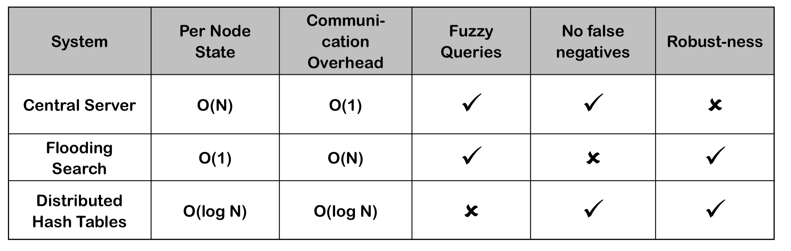

# Naming Systems

## Begriffe

| Begriff                   | Beschreibung                             |
| ------------------------- | ---------------------------------------- |
| Naming                    | Namen entities zuweisen                  |
| Name Resolution           | Name auflösen, Entity aufgrund von Name ermitteln |
| Name                      | Bytestring um Entität zu Identifizieren<br />*Beispiel DNS: Fully Qualified Domain Name* |
| Entity                    | *Beispiel DNS: Host*                     |
| Access Point              | Entität, welche verwendet wird um auf andere Entitäten zuzugreifen<br />*Beispiel DNS: Network Interface* |
| Address                   | Name von access point<br />*Beispiel DNS: IP* |
| Identifier                | Name mit folgenden Kriterien (wie Primary Key in DB):<br />- Referenziert höchstens eine Entität<br />- Jede Entität wird höchstens von einem Identifier referenziert<br />- Referenziert immer die Gleiche Entität (nicht wiederverwendet) |
| Human Friendly Name       | Für menschliche Nutzung angepasster Name, z.B. Domain Name |
| Location Independent Name | Standort von Entität kann ändern und trotzdem noch mit ihrem Namen gefunden werden. |


## Flat Naming

- Namen sind unstrukturiert (interne Struktur erlaubt z.B. IP Adresse, aber nicht für Auflösung verwendet)
- Broadcasting wird zur Auflösung verwendet, z.B. in ARP: "Wer ist 10.1.2.4 ?"

### Vorteile:

- kein Masterknoten benötigt
- einfach zu implementieren

### Nachteile:

- Skalliert nicht
- Einfach sich als andere Entity auszugeben

## Structured Naming

- Hierarchisch strukturiert, z.B. DNS
- Unterschiedliche Ebenen mit unterschiedlichen Verantwortungen, z.B. DNS: Global Layer, Administrational Layer, Managerial Layer
- **Iterative Auflösung**: tiefere Belastung der Server
- **Rekursive Auflösung**: Bessere Caching Möglichkeiten, macht Sinn wenn gleicher Request oft ausgeführt wird, z.B. www.google.com

## Attribute Based Naming

* Benutzer sucht mit Beschreibung in form von Attribute-Value Paar
* z.B. LDAP (Lightweight Directory Access Protocol): Mix aus Structured und Attribute Based Naming

# Distributed Hash Tables

- Ähnliches Prinzip, wie Java HashTable
- Key = hashCode(fileURL), Value = Id von verantwortlichem Node
- location(fileURL) = hashCode(fileURL) % nrOfNodes
- Verwendet speziellen Hash Algorithmus, so dass beim Hinzufügen und Entfernen von Nodes im Schnitt nur numberOfKeys / numberOfNodes Entries verschoben werden müssen.

## Chord

- Implementation von P2P DHT

- Benutzt m-Bit Identifiers für Nodes und Keys

- Namespace-Grösse: $2^m$

- m ist fix und gross (128, 160)

- Benutzt Hash Funktion mit Range $0 - 2^m - 1$

- Nodes kann man sich als logischen Ring vorstellen, Beispiel mit m = 3 und zwei Nodes:

  

- Nodes werden mit id (p) identifiziert, p = hash(IPAdressOfNode)

- Jeder Node kennt seinen successor, 1.successor = 4, 4.successor = 1

- Entität mit Key k gehört zu Node mit kleinstem Identifier p, so dass p >= k

  - Auf Deutsch
  - Entity k gehört zu Node p = k, oder
  - Entity k gehört zum "nächsten" p

- succ(k) Funktion (distributed function) gibt zurück auf welchem Node k gespeichert ist, z.B. succ(2) = 4

### Join

Um Joins effizienter zu machen, merkt sich jeder Node seinen Predecessor, z.B. 4.predecessor = 1.

1. Neuer Node n sucht seinen successor n.successor = succ(n  + 1)
2. Predecessor muss seinen successor updaten, wird aber nicht sofort gemacht sondern ersten im Stabilization Prozess
3. Alle resourcen von succ(n+1) mit Keys k so dass succ(k) = n müssen nach n verschoben werden

### Leaving (planned)

1. Node n will Ring verlassen
2. Alle resourcen von n werden an n.successor übergeben
3. n.predecessor wird informiert seinen successor auf n.successor zu ändern

### Lookup

- Naiver ansatz wäre Linearer Search => O(numberOfNodes) (jeder Node kennt seinen Successor, weiter bis Node verantwortlicher Node erreicht ist)
- Finger Table für schnelleren Lookup O(log N)
- Finger Table hat index i in Range 1 - m
- p.finger[i] zeigt auf succ(p + 2^(i - 1)) => p.figner[1] = succ(p + 1) = p.successor

**Beispiel p.lookup(k, a)**: Suche value für Key k und schicke Resultat an Adresse a:

1. Wenn p verantwortlich ist (p.predecessor < k <= p) sende id und Resource an a
2. Wenn Successor verantwortlich ist ( p < k <= p.successor), leite request an p.successor weiter
3. Sonst nächster Predecessor in Finger Table suchen und an diesen weiterleiten

### Stabilization

* Jeder Node führt regelmässig eine Stabilization durch. Dabei wird überprüft ob successor, predecessor und fingertable noch stimmen und falls nötig korrigiert.
* Successor wird überprüft indem p prüft ob p.successor.predecessor = p
* Predecessor wird korrigiert indem jeder Node, seinen Successor periodisch informiert, dass er der Predecessor ist.
* Jeder Node korrigiert regelmässig zufällige finger table entries: finger[i] = p.successor.lookup(n + 2^(i - 1), p)

### Leaving (unplanned)

- n verlässt Ring unerwartet 
- Alle Ressourcen von n gehen verloren 
- Ring ist unterbrochen bis nächste Stabilization

### Replication

- Replication ist Lösung damit Resourcen bei unplanned Leaves nicht verloren gehen.

- Jeder Entry wird r mal repliziert an folgenden Positionen:

  ```java
  for (int i = 0; i < r - 1; i++) {
    int replIdx = (hash(FileUrl) + i * Math.pow(2, m) / r) % Math.pow(2, m);
      storeReplicaAtPosition(replicaIndex);
  }
  ```

- Periodisch wird geprüft, ob alle Replikas noch verfügbar sind

# Synchronization

Synchronisierung von Zeit in einem verteilten System

## Physical Clocks

- Verschiedene Zeitzonen / Kalenderformate
- Basierend auf Quartzkristallen

### NTP


Offset wird korrigiert indem die Uhr schneller oder langsamer laufen gelassen wird. Ansonsten läuft man in die Gefahr, dass in Programmen, welche annehmen, dass die Zeit nur in eine Richtung läuft, Bugs auftreten.

## Logical Clocks

- Wird z.B. verwendet um zu Garantieren, dass Updatereihenfolge in einem verteilten DB-System, auf allen Nodes gleich ist.
- Die genaue Zeit von Ereignissen ist oft nicht wichtig, solange die Reihenfolge klar ist.

### Causality

* Causality ist als *happens before* relation bekannt, e.g. a &rarr; b (event a passiert vor event b)
* a &rarr; b ist wahr wenn mindestens eine der folgenden Bedingungen wahr ist:
  * a und b laufen im gleichen Prozess und a passiert vor b
  * a ist der Event des Sendens einer Nachricht und b ist der Event des Empfangens der gleichen Nachricht
  *  a&rarr; x && x &rarr; b (transitivität)

### Concurrency

* a || c heisst einfach, dass es keine &rarr; Relationen zwischen a und c gibt. 

### Übung Causality / Concurrency 


a1 &rarr; a3 wahr

a1 &rarr; b1 falsch

a1 || b1 wahr

a1 || a2 falsch

### Lambert's Logical Clock

- Implementation von Causality

- Lösung mit "Total Order"

- Jeder Prozess Pi hat einen internen Zähler Ci(a), welcher jedem Event a im Prozess eine Nummer zuweist.

- Jeder Prozess Pi inkrementiert (um wie viel ist egal) den Zähler zwischen aufeinanderfolgenden Events

- Mit jeder Message wird der aktuelle Zähler mitgeschickt.

- Event a: "senden m von Pi", Event b: "empfangen m auf Pj" &rarr; Cj(b) = auf max(Ci(a), Cj(b)) + 1

  

### Vector Clock

* Lambert's Clock definiert zwar eine "Total Order", kann aber Causality nicht genau abbilden: a &rarr; b &ne; C(a) < C(b), Vector Clock kann das
* Manchmal ist es nützlich zu wissen, dass zwei Events nicht Kausal voneinander abhängen
* Jeder Prozess verwaltet einen internen Vektor Vi mit folgenden Eigenschaften:
  * Vi[i] = Anzahl Events, die bis jetzt in Pi aufgetreten sind
  * Wenn Vi[j] = k, weiss Pi, dass k events auf Pj stattgefunden haben


## Vergleich (mathematisch)

Symbole:

* C(_) = Wert der Lamport's Clock für Event _
* T(_) = Wert der (theoretischen) global synchronisierten Uhr für Event _
* V(_) = Wert der Vektor-Uhr für Event _

Was ist IMMER wahr?

Lamport

* a -> b => C(a) < C(b) TRUE
* C(a) < C(b) => a -> b FALSE (können gleichzeitig sein)


# BitTorrent

File-Sharing. Ansatz mit Client/Server wäre ein CDN.

Ansatz von BitTorrent/P2P ist, dass ein File in Blöcke unterteilt wird, und jeder Client einen oder mehrere Blöcke vorliegen hat. Nun kann man herausfinden, welche Clients welche Teile haben, und von ihnen die entsprechenden Teile herunterladen.

Weiter kann man, wenn man nun einen Teil heruntergeladen hat, diesen auch wieder für andere Clients hochladen.

Achtung: zum Bootstrap/wie auch immer braucht es immer noch einen Tracker, welcher einem sagt, wo es denn Clients/Peers gibt (vergleiche Chord, einen Peer des Rings muss man bereits kennen). Ganz ohne Client/Server kommt es also nicht aus.

Terminologie

* Leecher: hat nur Teile eines Files (zur Verfügung gestellt)
* Seeder: stellt alle Teile zur Verfügung

Involvierte Parteien

* Tracker: weiss, wer die Peers/Clients sind
* Peer/Client: hält die Files bereit und meldet sich beim Tracker
* Web Server: hält .torrent-File bereit (=> enthält Tracker-Informationen, Hashes usw)

## File sharen/herunterladen

Sharen

* .torrent-File erstellen und X.file referenzieren
* .torrent-File im eigenen Client öffnen mit bereitliegenden X.file
* .torrent-File auf Web Server legen

Herunterladen

* .torrent-File auf Web Server finden
* .torrent-File öffnen
  * Tracker fragen, wer die Peers sind
* Von Peers herunterladen
* Zu anderen Peers hochladen

## Blöcke

Blöcke werden "Chunks" oder "Pieces" genannt und haben eine fixe Grösse (meistens 256KB). Der letzte Block wird natürlich kleiner. Diese werden mit SHA1-Hashes versehen (20 Byte)

## Piece Selection

Es gibt einige Algorithmen, welches Piece man zuerst sucht. Sie alle versuchen, die "Fairness" gegenüber dem Netzwerk (nicht zu viele Verbindungen) mit der "Geschwindigkeit" (möglichst schnell alle Pieces herunterladen) in Einklang zu bringen. Für Beispiele, siehe S. 15

## .torrent-File

Sections

* Announce: Tracker URLs
  * **Annahme: Tracker, welche die Netzwerke abdecken, in denen das File "rumschwirrt"**
* Info (Dictionary)
  * Name
  * Piece Length
  * Pieces (**Hashes?**)
  * Length (single File) ODER Files (Dictionary mit Name/Length)

Alles in Bencoding

## Peer Protokoll

Mit TCP herunterladen, nachher Verfügbarkeit den Peers bekannt geben

Fairness: Choking für solche, die nur herunterladen. Auch manchmal random unchoke, falls er sich gebessert hat.

# Bitcoin

Alle 10 Minuten neuer Block (Netzwerk ändert die Schwierigkeit, dass dies meistens der Fall ist). Die Schwierigkeit definiert, wieviel des Hashes übereinstimmen muss.

Wenn ein neuer Block geminet wird, erhält man momentan 12.5 BTC, was auch vom Netzwerk festgelegt wird.

Zusätzlich erhält man die Fees, der Transaktionen welche man in seinen Block aufgenommen hat.

Maximal 21 Mio BTC

Ab 6 nachfolgenden Blöcken wird dieser Block als bestätigt angesehen. Damit verhindert man, dass sich (längere) Trees bilden.

## Nachteile

* Power Consumption: 6 AKW Leibstadt
* Skalierbarkeit: Bitcoin 7 Transactions per Second, Visa 57'000
* Volatile Exchange Rate

# Basics P2P (Bocek)

## RPC (Remote Procedure Call)

Protokoll, um Code auf fremden Rechnern anzustossen und ein Resultat zu erhalten. Unterstützt Binary (Performance) aber auch Text-Kommunikation (JSON, einfacheres Debugging). Es gibt gRPC und Apache Avro als Library/Framework.

## Hole punching

To punch a hole, each client connects to an unrestricted third-party server that temporarily stores external and internal address and port information for each client. The server then relays each client's information to the other, and using that information each client tries to establish direct connection; as a result of the connections using valid port numbers, restrictive firewalls or routers accept and forward the incoming packets on each side. 

# DHTv1 Bocek

DHTs erlauben keine Fuzzy Search, garantieren aber keine False Negatives und sind robust. Pro Node muss O(log(N)) Daten gespeichert werden und es sind O(log(N)) Schritte für einen Lookup nötig.

Die Nodes und die "Files" verwenden denselben Addressraum. Sie konkurrenzieren aber nicht um Adressen. Das heisst, wenn es 1000 File-Adressen gäbe, gäbe es auch 1000 Node-Adressen. Es können aber beide die Adresse 336 haben.

Möchte man ein File finden (Routing), so fragt man einen bekannten Peer in diesem Netzwerk. Dieser sucht entweder selbstständig nach dem File und liefert es nach einiger Zeit zurück (rekursiv), oder er gibt einem die Adresse eines neuen Peers, der näher am File liegt.

Detail: egal ob iterativ oder rekursiv, kann es sein, dass man nur die Adresse des "End-Peers" erhält, statt das File direkt.



## Interface

Alle DHT-Implementationen bieten grob dieses Interface an.

* Provisioning (bekannt machen): `Put(key, value)`
* Requesting (searching): `Get(key)`
* Reply ist immer der `value`

## Kademlia

Kademlia arbeitet mit einer XOR-Metrik statt Numerical Closeness, wie z.B. von Chord bekannt. **160 Bit** Identifier (Nodes/Items). Distanz zwischen Key "45" (`0b101101`) und Key "46" (`0b101110`) berechnen:

```
101101
XOR
101110
=
000011
```

Die Distanz ist also `0b11` = 3

Bei Chord hat man von Distanz 1 1 Node, von Distanz 2 1 Node, ... von Distanz "halber Kreis" 1 Node. Bei Kademlia ist die Idee ähnlich, aber man hat Buckets für spezifische Distanzen. Dabei kennt man die Nachbarn besser, und die weiter entfernten Nodes weniger.

Construction of Routing Table: TODO

# DHTv2 Bocek

## Bloom Filter

Array mit `m` Bits, alle auf 0. Dann `m` unterschiedliche Hash-Funktionen verwenden, die als Output `[1..m]` haben. Auf diesem Index setzt man das Bit auf 1 (wenn es schon 1 ist, belässt man es)

* Insertion: Bits setzen
* Query: vielleicht ja, wenn alle Bits gesetzt sind (False Positive möglich); garantiert nein, wenn nicht alle gesetzt sind (keine False Negatives)
* Deletion: auf einem einfachen Bloom Filter ist das nicht möglich

False Positive Rate nimmt mit gefülltem Bloom Filter stetig zu.

Varianten:

* Compressed Bloom Filter, Generalized Bloom Filter (lässt entweder False Positives oder False Negatives zu), Counting Bloom Filters (Integer statt 0/1, so kann man auch löschen), Scalable Bloom Filter (wird grösser, wenn er zu voll wird)

# TODO Vorlesungen 08 (nach Bloom Filter)-10

# Etherum/Smart Contracts

Gute Beschreibung: http://solidity.readthedocs.io/en/v0.4.24/introduction-to-smart-contracts.html

Neuer Block alle 14s, ergibt 3 ETH (fix)

Nicht als Crypto-Währung gedacht! Sondern als Währung für Arbeit eines Smart Contracts.

Idee:

* Smart Contracts schreiben (Programm)
* Anweisungen haben einen Gas Price (in Gwei, 1 Milliarde Gwei= 1 ETH)
* Man sendet den Smart Contract und die Funds ins Netzwerk
* Falls die Funds nicht ausreichen (vom Miner validiert), wird der Zustand zurückgesetzt und die ETH/Gwei sind weg

Man kann das Ethereum-Netzwerk als globalen Computer ansehen. Jede Node rechnet den Smart Contract durch und erhält das gleiche Ergebnis. Kann man als "Etherum VM" (EVM) ansehen.

Basiert momentan noch auf Proof of Work, aber nicht ASIC-tauglich

Zwei Account-Arten:

* *externally controlled* (kontrolliert von einem Private Key)
* *contract*. Laufen nie von alleine, von Code kontrolliert, Aktionen werden von externally controlled-Accounts ausgelöst

(Accounts stossen Smart Contract an. Dieser Smart Contract kann dann wiederum einen anderen Smart Contract anstossen, aber es geht alles von einem Account aus)

Beide können ETH senden/empfangen

Bitcoin ist, im Gegensatz, UTXO-based.

## Account-based vs UTXO-based

Account-basiert

* Globaler State mit Accounts, die Balance und Code beinhalten
* Transaktion ist valid, wenn der Account genügend Balance hat
* Wenn der Receiver Code hat, läuft dieser
* Weniger Speicherplatz
* Einfacher ("Easier for smart contracts, stateful scripting")


UTXO-basiert

* Jeder Input muss valid sein und noch nicht verbraucht sein
* Der totale Input muss dem totalen Output entsprechen* (* oder darunter sein, aber das macht man nicht...)
* Höhere Privacy (neue Adresse für jede Transaktion)
* Keine Replay-Attacks (jedes Mal eine neue Nonce) **versteh ich noch nicht ganz**
* Transaktionen können parallel laufen, wenn Output/Input separat


## Merkle Tree

Hash-Tree. Hash 0 = Hash 0-0 || Hash 0-1 (|| = Concatenation)


### Beispiel eines Merkle Trees

Verification (BitTorrent)

* Peer A has top hash (root hash) 
* Peer downloads C4 from peer B
* create hash 8
* Need hash 10, 13, 3 (uncle hash)
* Can be from peer B 
* With 8,10,13,3 can create root hash → verify this root hash 


## Solidity

Sprache für Smart Contracts für Ethereum **nur für Ethereum?**

Um den Preis zu begründen, kann man sich immer überlegen, dass alle Nodes diese Berechnung durchführen müssen.

State-Variablen sind teuer!

Kennt primitive Typen, Structs, Maps und Arrays

`constant` Funktionen modifizieren den State nicht (siehe Getter-Code:)

```
function get(uint nr) public constant returns (string) { 
	return accounts[nr].addr;
}
function set(uint nr, string addr) public {
	require(owner == msg.sender);
	accounts[counter++] = Account(addr, nr); 
}
```

Reads sind gratis!

Preconditions mit require (z.B. Owner dieses Contracts = Absender `require(owner == msg.sender)`)

Gibt auch Events/Notifications (geht er aber nicht weiter drauf ein)

Der Konstruktur läuft nur ein einziges Mal (wenn der Contract erstellt wurde)

## ERC20

Mit Ethereum kann man eine eigene Währung aufbauen, die durch das Ethereum-System gesichert wird. Um das sauber zu produzieren, gibt es ERC-20 (ERC = Ethereum Request for Comments, analog RFCs oder PEPs).

Für mehr Details, letzte Vorlesung, S. 12ff

## Random Numbers

Sind ohne weiteres nicht möglich, da ja jede EVM zum selben Resultat kommen muss

Man kann aber "pseudo-randomness" verwenden, indem man z.B. die letzte Block-Nr als Input verwendet. Es ist zufällig in dem Sinne, dass man es beim Schreiben und veröffentlichen des Contracts nicht weiss, aber jede EVM es nachvollziehen kann.

## Exercises

> What is the main difference of an XOR metric vs. a metric in Chord/Pastry?

With the XOR approach the distance between node A and B is the same as between B and A. In chord this is not the case

[1.2. XOR Distance and Basic Routing - YouTube](https://www.youtube.com/watch?v=w9UObz8o8lY)

[Peer-to-peer (P2P) Networks - Basic Algorithms - YouTube](https://www.youtube.com/watch?v=kXyVqk3EbwE)

> How can you optimize locality in Kademlia?


> In which bucket on peer with id = 133 is the peer with id 199  stored in an 8-bit Kademlia system? 
> Kademlia nodes store contact information about each other to route query messages. For each 0 <= i < 160, every node keeps a list of (IP, Port, NodeId) triples for nodes of distance between 2^i and 2^(i+1) from itself. We call these list k-buckets.

133 ist binär 10000101
199 ist binär 11000111

Die XOR Verknüpfung lautet also 01000010 und das höchste Bit ist dann 7. Gemäss dem Whitepaper ist er dann im Bucket mit Ids [2^7 ; 2^8) also im Bucket 7.

> How does TomP2P send messages? JSON, Protobuf, or with a custom codec?

Probably custom: [TomP2P/Decoder.java at master · tomp2p/TomP2P · GitHub](https://github.com/tomp2p/TomP2P/blob/master/core/src/main/java/net/tomp2p/message/Decoder.java)

> What happens during the bootstrapping phase?

Bootrapping assumes that new nodes know a "well known peer" where the application can store and retrieve key and values. 

> Why does a blockchain not use DHTs to store data?

Eine DHT hat nicht zum Ziel, Veränderungen erkennbar/nachvollziehbar/verifizierbar zu machen. Dies sind aber die Ziele einer Blockchain.

Trust

> Message Queues are only used in distributed systems. True or False?

False. Die Message Queue selber ist oft als verteiltes System aufgesetzt, die Clients können anders entwickelt werden.

> What are Message Queues good for?

* "Fire and forget": eine Message senden, wer daran interessiert ist, kann subscriben. Keine Punkt-zu-Punkt Verbindungen
* Automatisches Queue Management (Message Broker)
* Decoupling

> Disadvantages of Message Queues?

added complexity

> Is Bitcoin using RSA or ECC for signatures?

ECC, smaller keys, more performance

> Are all the coins in an unspent TX output spent?

Transaction fee

> Does it matter when an input is signed? Can it happen after an output was appended?

> Bitcoin Scripts are Turing complete. True or false?

False

> Ethereum smart contracts are turing complete.

True

> Storage in Ethereum is cheap. True or False?

False. Storage ist eine der teuersten Operationen.

> Since the fork Ethereum classic did not revert TheDAO theft (3.6 million Ether), and an 1 ETC is currently worth 17$, the thief could have ~60m USD.

> Why is it not feasible to use a full client for the exercises?

Because you'd have to download the whole chain.

> Why is SafeMath often used?

> Why does transfer() return a boolean?

> What makes a token valuable?
